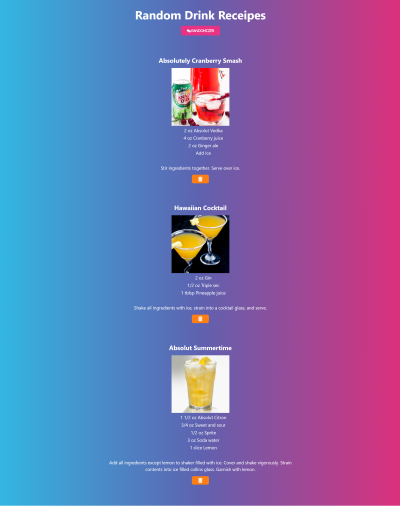
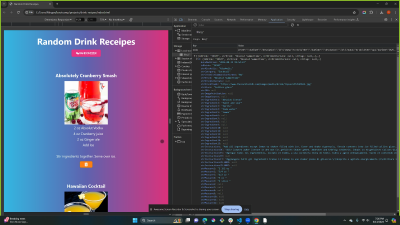

# Drink Recipes

## User Story
As a future bartender I want to learn how to prepare drinks to showcase my skills to future employers.

## Description
 This drink rescipe randomizer was created as a challenge for bootcamp students to apply everything that was learned in module 1-6 of class.
 The challenge will make this app run in the browser and feature dynamically updated HTML and CSS with the use of JavaScript. This app functionality will be achieved by using 
 third-party APIs and making requests with specific parameters to a URL to retrieve the data. Bootswatch and Font Awesome were also implemented to style the page.

## Acceptance Criteria

    - Given a web app to manage drink recipes
    - When I open the page, I am prompted with a randomizer button
    - When randomizer button clicked, I am prompted with a modal
    - In the modal I am prompted with a Martini icon to generate random drinks
    - When drink generates it appends to webpage
    - When the drink is displayed on the webpage it will include; drink name, an image, ingredients, measurements, and intructions to make the drinks.
    - When the drink is generated, it is stored into local storage
    - When the page is refreshed the drinks previously generate, stays on the webpage
    - Each drink will include a trash can icon to allow drinks to be deleted once no longer needed

## Screenshot

## Links

[LiveURL](https://meg-an321.github.io/drink-recipes/)

[GitHubRepo](https://github.com/meg-an321/drink-recipes)